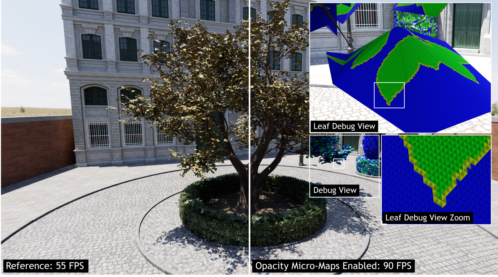

[](https://github.com/NVIDIAGameWorks/Opacity-MicroMap-SDK/actions/workflows/build.yml)
[](https://github.com/NVIDIAGameWorks/Opacity-MicroMap-SDK/actions/workflows/build.yml)
[](https://github.com/NVIDIAGameWorks/Opacity-MicroMap-SDK/actions/workflows/build.yml)
[](https://github.com/NVIDIAGameWorks/Opacity-MicroMap-SDK/actions/workflows/build.yml)

# Runnable Samples
Get the OMM SDK demo app: [https://github.com/NVIDIAGameWorks/Opacity-MicroMap-Samples](https://github.com/NVIDIAGameWorks/Opacity-MicroMap-Samples)

Or check out it's use in Path Tracing SDK: [https://github.com/NVIDIAGameWorks/Path-Tracing-SDK](https://github.com/NVIDIAGameWorks/Path-Tracing-SDK)

# Useful resources
- See [Micro-Mesh Basics slides](https://developer.download.nvidia.com/ProGraphics/nvpro-samples/slides/Micro-Mesh_Basics.pdf) for an introduction to Micro-Meshes
- See [Nsight Graphics 2023.1 - Release Spotlight](https://youtu.be/xGAs9guQtPE) for a demo of the Opacity Micro-Map viewer in Nsight Graphics 2023.1
- See [Getting Started with Compressed Micro-Meshes](https://register.nvidia.com/flow/nvidia/gtcspring2023/attendeeportal/page/sessioncatalog/session/1666430278669001BFSR) NVIDIA GTC 2023 presentation
- See [NVIDIA ADA GPU ARCHITECTURE - 2x Faster Alpha Traversal Performance with Opacity Micromap Engine](https://images.nvidia.com/aem-dam/Solutions/geforce/ada/nvidia-ada-gpu-architecture.pdf) for a technical overview of Opacity Micro-Maps and how they can help accelerate raytracing workloads.
- See [NVIDIA Ray Tracing Micro-Mesh](https://developer.nvidia.com/rtx/ray-tracing/micro-mesh) for latest news on Micro-Maps and Micro-Meshes.
- See [NVAPI 520 (or later)](https://developer.nvidia.com/rtx/path-tracing/nvapi/get-started) for details on the Opacity Micro-Maps extension for D3D12.
- See [VK_EXT_opacity_micromap](https://github.com/KhronosGroup/Vulkan-Docs/blob/main/chapters/VK_EXT_opacity_micromap/micromaps.adoc) for details on the Opacity Micro-Maps extension for Vulkan.
- See [NVIDIA OptiX](https://developer.nvidia.com/designworks/optix/download) and the [NVIDIA OptiX Programming Guide](https://raytracing-docs.nvidia.com/optix7/guide/index.html#acceleration_structures#accelstruct-omm) which goes in to more detail on the internal layout of the Opacity Micro-Map data format.

# Opacity Micro-Map SDK

<p align="center">
    
    
</p>

The images above illustrate Any Hit Shader (AHS) shader invocations without OMMs (left) and with a 4-state OMM produced by the SDK (right).

<p align="center">
    
</p>
Path tracing with OMMs enabled on alpha tested vegetation. Micro triangles are visible in the debug view, blue = transparent, green = opaque, yellow = unknown. Captured on an RTX 4090 (4K ~3.25 rpp).

## Overview
Opacity Micro-Maps (OMMs) are used to accelerate raytracing of high detail geometry by efficiently encoding the opacity states of micro-triangles and micro meshes. This technology encodes the opacity of micro-triangles and makes it possible to trace rays, at high performance, extremely detailed scene elements such as vegetation and foliage. Traditionally high detail opacity information is constructed via alpha textures, however, for raytracing this normally involves costly alpha evaluation in shaders to generate the desired result. Opacity Micro-Maps is a solution that can either remove the need for shader invocations entirely (by approximating the original geometry), or drastically reduce the number required of shader invocations without any loss in quality. OMMs will generally be an accelerator for applications that have traditional alpha testing or alpha blending as part of the raytracing workloads.

Opacity Micro-Maps is supported for raytracing in D3D12 (via NvAPI), VK and NVIDIA OptiX. For details on the data-structures and API usage please see [prerequisites](#prerequisites-and-useful-resources) for links and details.

## SDK Description
Opacity Micro-Map SDK is used to automatically convert existing alpha tested or alpha blended assets to opacity micro-maps without the need to manually convert existing, or author new, content. The asset-to-OMM conversion is done entirely by the SDK by parsing and analyzing the existing alpha texture and geometry to produce highly optimized and efficient OMM data ready direct for consumption by D3D12 or VK. The conversion can either be done at runtime, by the GPU baker, or offline by the CPU baker when pre-processing of assets is more practical. Which version to use depends on the user requirements, capabilities of the build infrastructure and title content. The GPU backend is designed to be executed by the client RHI on either D3D12 or VK. See the SDK integration guide for more in depth discussion. 

## Integration Guide
To read more about OMMs, the SDK and practical integration tips please see the [integration guide](docs/integration_guide.md).

# Sample Application(s)

## Opacity Micro-Map Samples
A full features sample application using the OMM SDK can be found here: *[Opacity-MicroMap-Samples](https://github.com/NVIDIAGameWorks/Opacity-MicroMap-Samples)*.

The sample demonstrates all features of the SDK, running on D3D12 or Vulkan with both GPU and CPU baking toggleable. The sample app runs raytracing with primary rays with specular and diffuse reflections with a configurable number of bounces. Use the UI to tweak the OMM format, subdivision level and other baking parameters. The sample includes a caching mechanism that is meant to illustrate the use of prebaked OMM data.

## Path Tracing SDK
Additionally the OMM SDK GPU baker is integrated in to the Path Tracing SDK: *[https://github.com/NVIDIAGameWorks/Path-Tracing-SDK](https://github.com/NVIDIAGameWorks/Path-Tracing-SDK)*.

# Build Instructions

## SDK Usage on Windows

1. Clone the repository with all submodules:
	- `git clone --recursive https://github.com/NVIDIAGameWorks/Opacity-MicroMap-SDK.git`

	If the clone was made non-recursively and the submodules are missing, clone them separately:

	- `git submodule update --init --recursive`
	
2. Configure the solution with CMake. The easiest option is to use [CMake GUI](https://cmake.org/download/).

3. Assuming that the OMM Bake SDK tree is located in `D:\Opacity-MicroMap-SDK`, set the following parameters in the GUI:
	- "Where is the source code" to `D:\Opacity-MicroMap-SDK`
	- "Where to build the binaries" to `D:\Opacity-MicroMap-SDK\build`

5. Click "Configure", set "Generator" to the Visual Studio you're using (tested with VS 2022 version 17.2.5), set "Optional platform" to x64, click "Finish".

6. Click "Generate", then "Open Project".

7. Build the solution with Visual Studio 

8. Either run the `INSTALL` project to generate header and binaries that can be linked to your project, or run `Tests` to run the unit tests.

9. If running ``INSTALL`` the following binaries will be generated in the cmake output folder which can be used to link to the client application.
```
%cmake output dir%
└───install
    └───include
    |   └─── omm.h
    └───lib
    │   └─── omm-sdk.lib
    └───bin
        └─── omm-sdk.dll
```
10. If running `Tests` and CMake have been configured with `-DOMM_TEST_ENABLE_IMAGE_DUMP` a folder with image files will be located in `D:\Opacity-MicroMap-SDK\build\tests\OmmBakeOutput` and  `D:\Opacity-MicroMap-SDK\build\tests\OmmBakeOutput_GPU`

## CMake options
`-DOMM_STATIC_LIBRARY=ON` - Will configure the omm-sdk project as either a SHARED (OFF) or STATIC (ON) target in CMake. 

`-DOMM_ENABLE_PRECOMPILED_SHADERS_DXIL=ON` - Enable this when using the GPU baker with precompiled shaders in D3D12. The DXIL will be part of the generated library files (.dll) and can be used direct to create the nessesary pipeline state objects at runtime. May get disabled if Windows SDK is not found on the system. Required to run GPU Unit Test.

`-DOMM_ENABLE_PRECOMPILED_SHADERS_SPIRV=ON` - Enable this when using the GPU baker with precompiled shaders in Vulkan. The SPIRV will be part of the generated library files (.dll) and can be used direct to create the nessesary pipeline state objects at runtime. This may get disabled if Vulkan SDK is not found on the system.

`-DOMM_SHADER_DEBUG_INFO=OFF` - Will include and embed shader debug (-Zi, -Qembed_debug) info when running OMM_ENABLE_PRECOMPILED_SHADERS_DXIL=ON or OMM_ENABLE_PRECOMPILED_SHADERS_SPIRV=ON. Only recommended for debugging purpuses.

`-DOMM_ENABLE_OPENMP=ON` - The project will include OpenMP to enable parallel execution of the CPU baking lib. This is required for ``EnableInternalThreads`` to be effective.

`-DOMM_INSTALL=ON` - Will configure the ``INSTALL`` solution to produce the library files that can be used in other projects. May need to be disable this when running the OMM SDK as submodule.

`-DOMM_DISABLE_INTERPROCEDURAL_OPTIMIZATION=ON` - Will disable LTO on the project via CMAKE_INTERPROCEDURAL_OPTIMIZATION.

# Support

Feel free to file issues directly on the GitHub page or reach out to NVIDIA at opacitymicromap-sdk-support@exchange.nvidia.com
