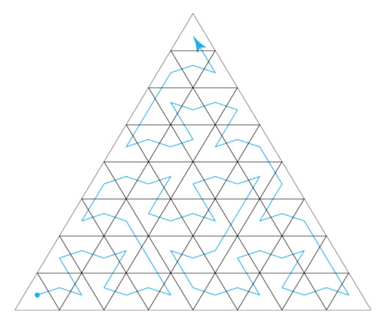
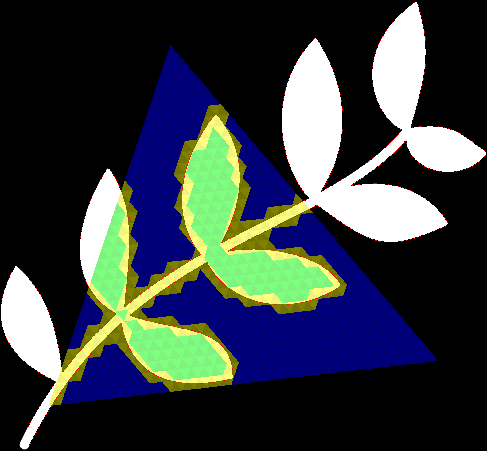

# NVIDIA Opacity Micro-Map SDK
<p align="center">
    
    
</p>

The images above illustrate Any Hit Shader (AHS) shader invocations without (left) and with (right) 4-state OMMs enabled.

# Opacity Micro-Map fundamentals

Micro-triangles are uniformly distributed over a triangle, this allows for efficient OMM state indexing via the barycentric coordiantes that fall out of the ray-triangle intersection test. An illustration of subdivision level 0, 1 and 2 is illustrated below.

<p align="center">
    
</p>

Up to 12 subdivision levels per triangle is supported. Each subdivision level will generate N^2 subdivisions per edge, or N^4 micro-triangles in total.

<p align="center">
    
</p>

An *OMM block of tightly bit-packed opacity states will be laid out in the "bird curve" pattern illustrated above. Similar to Morton space-filling curve used for textures, OMMs map micro-triangles in a "bird-curve" order (Named so due to it's resemblence to the Escher-like birds). 

Micro-triangle can either be ``Transparent(T)``, ``Opaque(O)``, ``Unknown Transparent(UT)`` or ``Unknown Opaque(UO)``. When a ray hits a triangle it will look up the corresponing micro-triangle state. If the micro-triangle state is Transparent ray query will proceed as if no tringle was hit, meaning that the AHS will not be invoked (and the RayQuery will not return a potential hit). If the state is Opaque, the surface will be considered opaque and the AHS will not be invoked and maxT updated accordingly. If it's the closet surface for the ray the CHS may still be invoked normally depending on how the ray and TLAS have been configured.

If the state is either of the two Unknown states (UT, UO) the opacity state of the triangle will be determined by the AHS or RayQuery object as usual. The difference between UT and UO matters when the 4-state is demoted to a 2-state version which can be done on the TLAS instance level or per ray. The demotion is useful in scenarios when a lower LOD is possible, for instance for secondary rays or when lower LOD objects are used. 

When the ray traversal unit on GPU can trivially reject / accept hits via the T, and O the total number of AHS (Or RayQuery returns) are minimized and the SMs are freed up for other shading work. This reduction leading to often significant speedup of the raytracing workload. See the [Opacity-MicroMap-Samples](https://github.com/NVIDIAGameWorks/Opacity-MicroMap-Samples) application for a practical demonstration. Even in a scene with moderate use of alpha testing (Bistor Exterior) tracing cost is cut by ~30%.

\* An OMM block is set of micro-triangles accosiated with one or more triangles.

## Reuse
OMM blocks can be reused between primitives which is useful for high poly meshes that do internal texture coordinate instancing. This is a common (and recommended with or without, OMMs) pattern, re-use will be automatically detected by the SDK both pre and post baking to ensure no redundant OMM blocks are maximally re-used.

## API level
OMMs are exposed in D3D12 and Vulkan via the ``RaytracingOpacityMicromapArray`` object type. Just like a TLAS references one or more BLASes a BLAS may also reference data in an ``RaytracingOpacityMicromapArray`` which contains the micro-triangle opacity data. The ``RaytracingOpacityMicromapArray`` is indexed with a primitive index buffer. The data to construct the ``RaytracingOpacityMicromapArray`` and corresponding BLAS index buffer is produced by the SDK.

# Integration guide checklist

Before integrating the baker SDK it might be useful to go over the checklist below to make sure that OMMs and the OMM SDK are compatible and useful for your application.

1. Identify assets - Does the application uses alpha testing or alpha blending to any extent in the raytracing workload? 
2. Alpha content is often where raytracing performance struggles the most, doing some sanity checks on the content, run FORCE OPAQUE flag to get a sense of the overhead. Note: FORCE OPAQUE will alter IQ and frame resuts, and can not be used to exactly determine the AHS overhead, be careful to draw too many conclusions.
3. Make sure the Alpha Testing shaders follow the alpha testing standard form. If they do not, consider simplifying them and converting them to this format. If that is not possible OMM asset conversion may still be feasable, but the SDK does not leave any guarantee on final quality: there may (or may not) be artifacts introduced from OMM and AHS mismatch. See overview of compatible shader types [here](#alpha-testing-shaders).
4. Decide if the runtime baking or offline baking is the best option. Depending on your needs either the CPU baker or the GPU baker can be integrated.
    * Pro Tip: If runtime baking (GPU baker) is desired, begin by integrating the CPU baker to quickly evaluate OMM performance. If happy with the results add the GPU baker to optimize the baking times.

# SDK

## Inputs & Outputs

<p align="center">
    
</p>

The primary input the baker needs to generate OMMs are:
* Index Buffer - IB as used for the corresponding BLAS the OMMs will be attached to.
* TexCoord Buffer - Texture coordinate buffer used during shading to read the alpha texture. 
* Alpha Texture - Alpha texture used during shading for opacity evaluation. 
* Config
    * Basic runtime shader info, such as alpha cutoff value and expected sampler type. 
    * Desired subdivision level(s) 
    * Desired OMM format(s)
    * ... etc

The output of the baking operation is data that can be fed directly to the D3D12 or VK runtime.
There are two targets, some data go straight to the BLAS build, and the rest is used to build ``RaytracingOpacityMicromapArray``:

* OMM Array Inputs - Data for ``RaytracingOpacityMicromapArray`` build. This buffer is input to BLAS build.
    * See [Opacity-MicroMap-Samples](https://github.com/NVIDIAGameWorks/Opacity-MicroMap-Samples) for a practical example.html#acceleration_structures#accelstruct-omm) for implementation details.
* OMM BLAS inputs - OMM Histogram and Indices that reference data in OMMArray
    * Index buffer referencing OMM descripors in OMM Array,
    * OMM Histogram data.


## Sample output

<p align="center">
    
</p>

Above is a visualization of opacity micro maps baked with subdivision level 5. Micro-triangle states are color coded as O (Green), T (Blue), UO (Yellow). The AHS will only be invoked on the yellow triangles, the rest will be read and resolved by the raytracing hardware directly on Ada. For pre-Ada hardware the opacity states will be resolved in software in an emulation mode. The software fallback is lightweight as indexing of the OMM block can be done trivially via barycentrics, the emulation may still produca a speedup.

In 4-state mode the speedup is typically correlated to the ratio of known states to to unknown states \*. A useful metric is the coverage factor C:

$$ C = {\frac{T+O}{T+O+UT+UO}} $$ 

Maximizing C (globally and per triangle) is typically done either by forcing 2-state mode (at the loss of detail) or increasing the subdivision level. Furthermore, a resampling algorithm can be chosen to be more or less conservative - it's always safe in terms of correctness to mark any micro-triangle as unknown and fall back to shader for final evaluation. However, being overly conservative comes at the cost of coverage. For this reason, the OMM SDK is designed to always optimize coverage. The OMM SDK goes to great lengths to achieve this goal - it will analytically trace the alpha contour line formed by the alpha textures and alpha cutoff-plane as possible find the state of micro-triangles and only mark micro-triangles with a proven mixed state as unknown.

In other words: the OMM SDK will _always_ produce the optimal coverage. 

\* OMM performance depends on many factors, OMM block size, amount of reuse and cost of AHS, etc. However when everything else is equal, there tend to be a relationship between C and the observed OMM speedup. 

# GPU vs CPU Baker
The SDK comes with a baking algorithm running purely on CPU side and another version doing the heavy lifting on the GPU via HLSL/VK. They have different pros and cons as outlined below.
Situations when the CPU baker is a preferred option include:

- Situations when the __CPU baker__ is preferred
    - The application want to pre-bake OMMs offline in a pre-step. For instance on a build farm or similar.
        - Decouple the OMM producing system to the OMM consuming system.
        - The content processing doesn't have GPU access.
        - Pre-baking is useful when there's a limited set of assets that need baking, without dynamic content. The baking can complete for the complete set of assets in finite time and storage space. 
    - The baking doesn't have to happen real time, for instance a limited set of assets in a loading screen or similar.
    - Quickly prototype OMMs for evaluation purposes as a stepping stone before integrating the GPU baker.
    - Note: Be mindful that OMMs consume disk space, for massive open world games it may not be practical to pre-bake all data.

- Situations when the __GPU baker__ is preferred
    - Baking must happen during interactive rendering. Running GPU baking is significanlty(!) more efficient compared to CPU baking, it can be done during rendering via async compute or amortized over multiple frames.
    - It's impractical or not possible to produce pre-baked OMM data. Perhaps the content is dynamic, or other limitations in the build system makes this impossible.
    - Note: make sure to balance the cost of baking to the benefit of OMMs, it's recommended to allocate a limited frame budget for OMM baking each frame.

# Algorithm Overview
The baking algorithm in the SDK is designed to optimize OMM reuse and in the case of 4-state OMMs, it will maximize the amount of known state. The end result is a highly efficient and compact ``RaytracingOpacityMicromapArray``. Below follows an explanation of the steps involed when running the baking algorithm. Some steps are exclusive to the CPU baker which does not have the requirement to run in real time.

## 1. Reuse pre-pass (CPU & GPU)
The first step is to analyze the texture coordinates to find duplicates. If texture coordinates are bit-identical for two or more primitives the resulting OMM array data can be shared (assuming the same subdivision level and format is used). This is done by utilizing a hash table and hashing the texture coordinates and other subdivision level parameters. Once this is done the baker has distilled down a set of unique OMM blobs that need to be baked. It is not uncommon for assets to heavily instance texture coordinates within the mesh, this is good. *Note* To speed up baking make sure that "almost" similar texture coordinates are de-duplicated in the asset pipeline. The baker can not safely do this snapping step before baking (it will do it post-bake) since the texture coordinates in the AHS must also be updated.

## 2. Determine Subdivision level (CPU & GPU)
OMMs support up to 12 subdivision levels, where the total number of micro-trianlges per level is 4^N. The default heuristic in the SDK is to tune the subdivision level such that a micro triangle covers a given fraction of the UV-space (as expressed in pixels). It's possible to override this and force a uniform global subdivision level over all micro-triangles or to override the subidivision level per triangle. 

## 3. Optimal resampling micro-triangle space (CPU & GPU)
Once the OMM blocks have been allocated the baker will try to figure out the state, conservatively, for each micro-triangle. The resampling is done in favour to maximize the coverage known to unknown ratio states. This is done by deconstructing the alpha texture contour-line and search for interesection points to the micro-triangles. If no such intersection is found the micro triangle state is known. This method guarantees optimal coverage, regardless of texture resolution, and is one of the key features of the SDK. The other benefit of this representation is that the 2-state mode will have a smoother look as the intersection between known and unknwon fill form a triangle-strip which is arguably more pleasing than the alternatives.

## 4. Identify uniform states (CPU & GPU)
If all micro-trangles in an OMM block all have the same state they can be promoted to "special indices", which removes the need for an explcit OMM block entierly. It's not uncommon for certain parts of meshes to be fully opaque, for instance the bark on trees.

## 5. Reuse post-pass (CPU)

Once the baking is done a second pass is run to find if any two OMMs have the same exact same content, and if they do, they will be merged to produce an even more compact representation. This can be the case for texture coordiantes that are *almost* similar, but not bit exact and not caught in *1.Reuse pre-pass*. 

## 6. Spatial-Sort (CPU)

It is recommended to sort the final OMM blocks spatially to maximize cache when doing state lookups. For this reason OMMs are sorted in morton order over the texture domain, (the texture domain is assumed to be a proxy of the relativle locations also in world space). Additionally blocks are sorted from highest subdivision level to lowest to achive natural block aligment.

# Subdivision Level

<p align="center">
    
</p>

Subdivision level 0 to 8 visualized (0 to 65536 micro-triangles). Blue = Transparent. Green = Opaque. Yellow = Unknown.

What is a suitable subdivision level? Eventually a high subdivision level yeilds diminishing returns where the amount of memory consumed grows while the coverage (C) doesn't change significantly. Too low subdivision level may not be effective to capture the opacity states at all. To further complicate things, having a global setting may not be effective on a mesh with varying triangle sizes.

The SDK contains a heuristic to compute a suitable subdivision level controlled via ``float dynamicSubidivisionScale``. This controls the approximate number of texels in the alpha texutre that each each micro-triangle will cover. That way the texel size and triangle size are both used as a resolution guide. Setting ``dynamicSubidivisionScale = 0`` will force the max subdivision level if a uniform global subdivision level is required.

It might make sense to scale the subdivision scale in proportion to the size of the triangle in world space (not texture space) the thinking is that the UV space coverage should be proportional to the WS size. If that is not the case, or when explicit control of the subdivision level per triangle is desired for other reasons detailed control is exposed via ``uint8_t* subdivisionLevels`` and ``IN_SUBDIVISION_LEVEL_BUFFER``.

# 4-state vs 2-state format

There are two format options: ``omm::OMMFormat::OC1_2_State`` and ``omm::OMMFormat::OC1_4_State`` (OC stands for Order Curve). The formats can be set independently per primitive or globally for all primitives.

## 4-State
In this mode micro-triangles can either be Opaque or Transparent, any micro-triangle the level-line intersects will be marked as unknown.

Below is an example of a triangle with resolved statates.

<p align="center">
    
    
</p>

Yellow=Unknown Opaque. Pink=Unknown Transparent. The right image uses only Unknown Opaque.

Images like this one can be produced by the SDK after baking which is useful for debugging purposes via the ``SaveAsImages`` function:

```cpp
// Walk each primitive and dumps the corresponding OMM overlay to the alpha textures.
OMM_API Result OMM_CALL SaveAsImages(Baker baker, const Cpu::BakeInputDesc& bakeInputDesc, const Cpu::BakeResultDesc* res, const SaveImagesDesc& desc);
```
Use this function to sanity check the baking output. The triangles can be all drawn in the same .png file or separated in to # primtivie files.

## 2-State
Enabling of 2-State OMMs is done via the ``omm::OMMFormat::OC1_2_State`` (OC stands for Order Curve).
In this mode micro-triangles can either be Opaque or Transparent. This mode will not normally preserve the original content appearence. In this mode the Unknown states are not available, so either a Opaque or Transparent must be chosen. The SDK offers three options to promiote a mixed state to T or O: Nearest, ForceOpaque and ForceTransparent.

- Nearest
    - Nearest will try to get the cloest state in terms of coverage. If the micro-triangle covers "mostly" transparent regions it will be marked as transparent (and vice versa). 

- ForceTransparent
    - Mixed states will be trivially promoted to Transparent. 
        - It will produce a smooth triangle-strip like shape. (See images below)
- ForceOpaque (Recommended)
    - Mixed states will be trivially promoted to Opaque. 
    - This mode has two benefits: 
        1. It will produce a smooth triangle-strip like shape. (See images below)
        2. It will produce more opaque triangles than ForceTransparent which generally improves RT perforamce.

<p align="center">
    
    
</p>

Notice how the left image ``omm::UnknownStatePromotion::Nearest`` produces a more "jaggy" shape along the border, while still captures the overall coverage pretty closely. Often a better better option is to use any of the ``omm::UnknownStatePromotion::Force*`` modes which generally forms a smoother triangle-strip cut along the intersection line (right). So while the Nearest option produces more accurate in terms of overall coverage, the Force* options produces smoother shapes and arguably more pleasing geometry.

# Alpha Testing Shaders (4-State)

When using 4-state Opacity Micro-Maps each micro-triangle can be tagged as either `Opaque`, `Transparent`, `Unknown Opaque` or `Unknown Transparent`. If a ray hits a micro triangle with an unknown state, the original any hit shader will be invoked to determine the final opacity state. For this reason (and to keep the appearance of assets unchanged) the baker must know how the alpha shader is programmed so that the micro triangle states can be resampled correctly and avoid mismatch to the original content. The resampling must be done conservatively: for the baker to tag a micro-triangle as opaque or transparent it must be able to prove that an arbitrary triangluar area of texture space is above, or below the alpha threshold.

Below is a list of supported shader formats. The application shaders should ideally be (functionally) identical to prevent shader and OMM mismatch which may alter the original content.

## <span style="color: green">Type 1</span> Simple Standard Form (recommended, produces highest OMM quality)
Supports:
- Single alpha texture (Any texture format)
- Linear or point sampling
- Constant alpha threshold (or hardcoded value)
- Constant mip-bias (or hardcoded value)

No supported:

- Per Ray dynamic mip-bias

The standard form of alpha testing is described below. If your applicaton uses a variation of this, OMM Bake will work optimally and produce pixel-idential results (for 4-state OMMs).
```cpp
["AnyHit"]
void EvaluateAlpha_StandardForm(
  inout Payload payload, 
  in float2 barycentrics // The barycentric coordinates provided by 
  )
{
  const float texCoords = GetTexCoords(barycentrics);
  const float alpha = AlphaTexture.SampleLevel(g_PointOrLinearSampler, texCoords, g_globalMipBias);

  if (alpha > g_AlphaThreshold) // alternatively "if (alpha < g_AlphaThreshold)"
  {
      // Opaque
      AcceptHitAndEndSearch();
  }
  else
  {
      // Transparent
      IgnoreHit();
  }
}
```

Notes: if the g_globalMipBias changes frequently, for instance due to texture streaming or LOD settings, the OMM data may need to be changed. There are different strategies to deal with that scenario in case there are noticable artifacts:

- Bake multiple OMMs and update the BLAS as needed.
- Bake only OMMs for mip 0 and use the instance flags to disable OMMs intermittently.
- Bake a single conservative OMM that covers all possible MIPs (Same as Type 2).

##  <span style="color: green">Type 2</span> Standard Form with per ray mip-bias (may be lower quality than Type 1)

Supports:
- Single alpha texture (Any texture format)
- Linear or point sampling
- Global alpha threshold (or hardcoded value)
- Per Ray dynamic mip-bias

This is identical to the standard form except the mip bias is changing per ray, or changes in such a way that the solutions in Type 1 is not applicable.
```cpp
["AnyHit"]
void EvaluateAlpha_StandardForm_PerRayMipBias(
  inout Payload payload, 
  in float2 barycentrics // The barycentric coordinates provided by 
  )
{
  const float mipBias = ComputeMipBiasUsingRayDifferentials(payload, barycentrics);
  const float texCoords = GetTexCoords(barycentrics);
  const float alpha = AlphaTexture.SampleLevel(g_PointOrLinearSampler, texCoords, mipBias);

  if (alpha > g_AlphaThreshold) // alternatively "if (alpha < g_AlphaThreshold)"
  {
      // Opaque
      AcceptHitAndEndSearch();
  }
  else
  {
      // Transparent
      IgnoreHit();
  }
}
```
For this solution to produce correct OMMs, the OMMs must be baked and conservativley take multiple MIP levels in to account. This may produce lower ratio of known / unknown states in 4-state which is why having per ray mip bias is not recommended. A per ray mip bias via ray cones or similar can also add const to the original alpha shader, removing it is often preferred for alpha testing. 

## Type 3 - <span style="color: red">**Arbitrarily complex shaders**</span>
The possible expressions to evaluate alpha shader is theoretically infinite, it's not uncommon to combine two alpha textures for certain effects and the possibility of OMMs working well will be hard to determine up front. Below is an example where the alpha is a function of two textures and vertex opacity. A generalized form of resampling for arbitrary functions does not exist.
```cpp
["AnyHit"]
void AlphaTestStandardForm(
  inout Payload payload, 
  in float2 barycentrics // The barycentric coordinates provided by 
  )
{
  const float texCoords = GetTexCoords(barycentrics);
  const float vertexAlpha = GetVertexAlpha(texCoords);
  const float alpha_layer0 = AlphaTexture_Layer0.SampleLevel(g_PointOrLinearSampler, texCoords, g_globalMipBias);
  const float alpha_layer1 = AlphaTexture_Layer1.SampleLevel(g_PointOrLinearSampler, texCoords, g_globalMipBias);

  const float alpha = vertexAlpha * lerp(alpha_layer0, alpha_layer1, x);

  if (alpha > g_AlphaThreshold) // alternatively "if (alpha < g_AlphaThreshold)"
  {
      // Opaque
      AcceptHitAndEndSearch();
  }
  else
  {
      // Transparent
      IgnoreHit();
  }
}
```

### Type 3 - Mitigation Strategies
- **Convert your shaders**: 
Try to convert your existing assets in to either Type 1 or Type 2. This typically involves simplifying the original shader, in which case it's a good general strategy to improve raytracing performance.
-  **Only use 2-State OMMs**: Bake OMMs using 2-state format in high resolution and enable OMMs for rays / objects where jaggies are not noticable. For instance only enable OMMs for the second ray bounce, or for lower LOD models. For primary rays and other important rays (mirror reflections) disable OMMs via ray flags. 

## TraceRayInline DXR 1.1
The above examples have illustraced alpha testing in an environment running Shader Tables (DXR 1.0 style) OMMs are also supported for trace ray inline, and the same shader format rules apply. 


# Texture Compression (CPU, 4-state)

To guarantee correctness the CPU baker should be using the same alpha value as is used in the runtime shaders. This means for instance if the runtime is using BC-compressed texture data the baker must also be baking with BC-compressed data and not with the source representation.

By inspecting the API we see that only a single textue format is supported:

```cpp
enum class TextureFormat 
{
    FP32,
    MAX_NUM,
};
```

This is by design, the expectation is that the application first does a conversion from the *runtime* format to single channel float. Refer to existing libraries, for instance [DirectXTex](https://github.com/microsoft/DirectXTex) or [detex](https://github.com/hglm/detex).


The following _NOT_ the expected data flow. This can lead to OMM and AHS mismatch.


The image above illustrates the expected data flow for 4-state OMMs using a BC7 format at runtime. Depending on the texture format an additional texture decompression step may have to be performed before passing in the data to OMM SDK.

For the GPU baker no special considerations have to be made as long as the ``IN_ALPHA_TEXTURE`` is the same texture format as used for the runtime shader.

# MIP Mapping (4-state)

Just like the case for texture compression, it's important that the OMMs match the shader version of the alpha test exactly to avoid artifacts. Problems can therefore arise when there is a need to change the mip frequently, or even worse, dynamically per ray. Having OMMs baked from a given MIP and later render at higher MIP levels naively can lead to artifacts, and depending on the application even a small texture-space delta can lead to a large error. Articacts are typically noticed when tracing instance primary rays and shadow rays as they may project a tiny objects on a larger area.  

Note this section is not relevant when using 2-state OMMs as there's no fallback shader mechanism in place and 2-state won't in the general case exactly match the original content (by design).

## General recommendation
Do not use dynamic mip level at all if possible. Pick a texture mip and always use that version. It might be tempting to use ray-cones also for AHS shaders, but the benefits for raytracing are few. The quality benefit of ray cones for the purpuse of alpha testing is lacking since the pre convloution of the alpha values does not converge faster due to the binary alpha test. For primary rays it may reduce aliasing.

## Strategies for _Per-Frame MIP_ (e.g texture straming)

### 1 - Do nothing.
It might not show up as a problem in practice. Make sure that there is a problem before solving it.

### 2- N BLAS & N OMMs
One possible solution is to bake each mip level independently and store one OMM array per mip level, and build a corresponding BLAS as well. Each frame determines which BLAS to use depending on the current texture mip. The benefit of this approach is optimal perf and quality, the downside is increased memory and omm/blas building cost.
### 3 - 1 BLAS & N OMMs
Another solution is to use a single BLAS with N independently baked OMMs and update them as needed via BLAS refit. Note that the BLAS must have the flag ``NVAPI_D3D12_RAYTRACING_ACCELERATION_STRUCTURE_BUILD_FLAG_ALLOW_OMM_UPDATE_EX`` set. Having this flag set may imply higher OMM cost and less effective use of OMMs over all. This approach uses less memory compared to 2. but may not produce as efficient BLASes.
### 4 - Strict coupling of geometry LOD and texture MIP
It might be useful to start thinking about alpha texture as refined geometry detail, and if it can be argued that the geometry LOD should be pinned to a specific texture MIP as independently changing the two geometry parameters should be derived from the same LOD computation logic which typically is a function of object location and extent in relation to the camera.

## Strategies for _Per Ray dynamic MIP_ (e.g ray cones)
There are scenarios where the runtime shader determines the textuer LOD per ray. In this scenario it might be useful.

### 1 - Disable per ray mip bias
Best for general performance and OMMs. If not possible, see 2.

### 2 - Generate conservative OMMs
If it must be used, the baker can read multiple texture slices and produce an OMM mask that is guaranteed to conservatively cover a set of possible texture slices. Producing this overly conservative masks solves the correctness problem at the cost of reduced coverage. Use this strategy only when no other approach works as it adds baking time and lowers the runtime performance.

<p align="center">
    
    ->
    
</p>

Left animation flips throuhg each mip level from 0 -> 5 individually baked. Right image shows the intersection of all states for all texture mip levels overlaid. Notice its lower coverage %.

# Integration Details

First initialize the library by creating a ``Baker`` instance handle. Here the baker type is decided, as well as an optional memory allocation callbacks if the engine prefers to use it's own system for memory tracking.

```cpp
enum class BakerType : uint8_t 
{
    GPU,
    CPU,

    MAX_NUM
};
...
struct BakerCreationDesc
{
    BakerType                   type                        = BakerType::MAX_NUM;
    bool                        enableValidation            = false;
    MemoryAllocatorInterface    memoryAllocatorInterface;
};
...
OMM_API Result OMM_CALL CreateOpacityMicromapBaker(const BakerCreationDesc& bakeCreationDesc, Baker* outBaker);
```
# CPU Baker

If the CPU baker is used a texture object must first be created, this should contain the alpha values identical to the way they would be read in the AHS at runtime. 

```cpp
struct TextureMipDesc
{
    uint32_t        width           = 0;
    uint32_t        height          = 0;
    uint32_t        rowPitch        = 0; // If 0 => assumed to be equal to width * format byte size
    const void*     textureData     = nullptr;
};

struct TextureDesc
{
    TextureFormat           format      = TextureFormat::MAX_NUM;
    TextureFlags            flags       = TextureFlags::None;
    const TextureMipDesc*   mips        = nullptr;
    uint32_t                mipCount    = 0;
};
...
OMM_API Result OMM_CALL CreateTexture(Baker baker, const TextureDesc& desc, Texture* outTexture);
```
Preferrably use only a single MIP level (See  [MIP Mapping](#mip-mapping-(4-state))).

Then just pass in the texture handle toghether with the other baking parameters and data to the baker.

```cpp
OMM_API Result OMM_CALL BakeOpacityMicromap(Baker baker, const BakeInputDesc& bakeInputDesc, BakeResult* outBakeResult);
```

This is a blocking and time consuming process as each micro-triangle will be effectively rasterized and compared to the texels in the texture object. A strategy to speed up the baking is to run multiple baking operations in parallel (baking tasks are thread safe, no need to create multiple Baker handles). In scenarios where that is not possible the bake flag ``EnableInternalThreads`` can be set to let the baker use internally spawned threads. Currently implemented via OpenMP.

Bake flags and their intended use case is documented in the header. Refer to the Sample app and unit tests to see examples of how the CPU baker is library is used. For instance, the "MinimalSample" test below demonstrate how to use the CPU baker to produce OMM data.

```cpp
TEST(MinimalSample, CPU) 
{
    // This sample will demonstrate the use of OMMs on a triangle fan modeled on top of a donut.
    const float rMin = 0.2f; // Circle inner radius.
    const float rMax = 0.3f; // Circle outer radius.

    // The pixels in our alpha texture. 
    // Here we'll create a procedural image (circle).
    // In practice we'll load image from disk, and may have to run compression / decompression before storing it.
    const uint32_t alphaTextureWidth = 256;
    const uint32_t alphaTextureHeight = 256;
    std::vector<float> alphaTextureDataFP32;
    alphaTextureDataFP32.reserve(alphaTextureWidth * alphaTextureHeight);
    for (uint32_t j = 0; j < alphaTextureHeight; ++j)
    {
        for (uint32_t i = 0; i < alphaTextureWidth; ++i)
        {
            const int2 idx = int2(i, j);
            const float2 uv = float2(idx) / float2((float)alphaTextureWidth);
            const float alphaValue = glm::length(uv - 0.5f) > rMin && glm::length(uv - 0.5f) < rMax ? 1.f : 0.f;
            alphaTextureDataFP32.push_back(alphaValue);
        }
    }

    // Here we'll setup a triangle "diamond" of 4 triangles in total that covers our circle.
    std::vector<float2> texCoordBuffer = 
    { 
        {0.05f, 0.50f},
        {0.50f, 0.05f},
        {0.50f, 0.50f},
        {0.95f, 0.50f},
        {0.50f, 0.95f},
    };

    std::vector<uint32_t> indexBuffer =
    {
        0, 1, 2,
        1, 3, 2,
        3, 4, 2,
        2, 4, 0,
    };

    omm::BakerCreationDesc desc;
    desc.type = omm::BakerType::CPU;
    desc.enableValidation = true;
    // desc.memoryAllocatorInterface = ...; // If we prefer to track memory allocations and / or use custom memory allocators we can override these callbacks. But it's not required.

    omm::Baker bakerHandle; // Create the baker instance. This instance can be shared among all baking tasks. Typucally one per application.

    omm::Result res = omm::CreateOpacityMicromapBaker(desc, &bakerHandle);
    ASSERT_EQ(res, omm::Result::SUCCESS);

    // Since we configured the CPU baker we are limited to the functions in the ::Cpu namespace
    // First we create our input texture data.
    // The texture object can be reused between baking passes.

    omm::Cpu::TextureMipDesc mipDesc;
    mipDesc.width = alphaTextureWidth;
    mipDesc.height = alphaTextureHeight;
    mipDesc.textureData = alphaTextureDataFP32.data();

    omm::Cpu::TextureDesc texDesc;
    texDesc.format = omm::Cpu::TextureFormat::FP32;
    texDesc.mipCount = 1;
    texDesc.mips = &mipDesc;

    omm::Cpu::Texture textureHandle;
    res = omm::Cpu::CreateTexture(bakerHandle, texDesc, &textureHandle);
    ASSERT_EQ(res, omm::Result::SUCCESS);

    // Setup the baking parameters, setting only required data.
    omm::Cpu::BakeInputDesc bakeDesc;
    bakeDesc.bakeFlags = omm::Cpu::BakeFlags::None; // Default bake flags.
    // Texture object
    bakeDesc.texture = textureHandle;
    // Alpha test parameters.
    bakeDesc.alphaCutoff = 0.5f;
    bakeDesc.alphaMode = omm::AlphaMode::Test;
    bakeDesc.runtimeSamplerDesc = { .addressingMode = omm::TextureAddressMode::Clamp, .filter = omm::TextureFilterMode::Linear };
    
    // Input geometry / texcoords
    bakeDesc.texCoordFormat = omm::TexCoordFormat::UV32_FLOAT;
    bakeDesc.texCoordStrideInBytes = sizeof(float2);
    bakeDesc.texCoords = texCoordBuffer.data();
    bakeDesc.indexBuffer = indexBuffer.data();
    bakeDesc.indexCount = (uint32_t)indexBuffer.size();
    bakeDesc.indexFormat = omm::IndexFormat::I32_UINT;
    
    // Desired output config
    bakeDesc.ommFormat = omm::OMMFormat::OC1_2_State;
    bakeDesc.unknownStatePromotion = omm::UnknownStatePromotion::ForceOpaque;
    // leave the rest of the parameters to default.

    // perform the baking... processing time may vary depending on triangle count, triangle size, subdivision level and texture size.
    omm::Cpu::BakeResult bakeResultHandle;
    res = omm::Cpu::BakeOpacityMicromap(bakerHandle, bakeDesc, &bakeResultHandle);
    ASSERT_EQ(res, omm::Result::SUCCESS);

    // Read back the result.
    const omm::Cpu::BakeResultDesc* bakeResultDesc = nullptr;
    res = omm::Cpu::GetBakeResultDesc(bakeResultHandle, bakeResultDesc);
    ASSERT_EQ(res, omm::Result::SUCCESS);

    // ... 
    // Consume data
    // Copy the bakeResultDesc data to GPU buffers directly, or cache to disk for later consumption.
    // ....

    // Visualize the bake result in a .png file
#if OMM_TEST_ENABLE_IMAGE_DUMP
    const bool debug = true;
    if (debug)
    {
        omm::Debug::SaveAsImages(bakerHandle, bakeDesc, bakeResultDesc,
            { 
                .path = "MinimalSample",
                .oneFile = true /* Will draw all triangles in the same file.*/
            });
    }
#endif
    
    // Cleanup. Result no longer needed
    res = omm::Cpu::DestroyBakeResult(bakeResultHandle);
    ASSERT_EQ(res, omm::Result::SUCCESS);
    // Cleanup. Texture no longer needed
    res = omm::Cpu::DestroyTexture(bakerHandle, textureHandle);
    ASSERT_EQ(res, omm::Result::SUCCESS);
    // Cleanup. Baker no longer needed
    res = omm::DestroyOpacityMicromapBaker(bakerHandle);
    ASSERT_EQ(res, omm::Result::SUCCESS);
}
```

Running the code above with ``OMM_TEST_ENABLE_IMAGE_DUMP`` produces a folder "MinimalSample" with the following image:

<p align="center">
    
</p>

# GPU baker

The GPU baker does not itself execute any command on the GPU. Instead it provides a sequence of rendering commands together with precompiled shader data(optional) as DXIL or SPIRV. There are two variants to integrating the SDK.

## Variant 1: Black-box library (using the application-side Render Hardware Interface)
RHI must have the ability to do the following:

* Create shaders from precompiled binary blobs
* Create an SRV and UAV for a specific range of subresources
* Create and bind predefined samplers
* Invoke Dispatch calls
* Invoke Indirect Dispatch calls
* Invoke Indirect Draw calls (Optional)
* Bind a null RTV (Optional)
* Enable conservative rasterization (Optional)
* Create 2D textures with SRV access

## Variant 2:  White-box library (using the application-side Render Hardware Interface)
Logically it's close to the Method 1, but the integration takes place in the full source code (only the OMM project is needed). In this case OMM shaders are handled by the application shader compilation pipeline. The application should still use OMM via OMM API to preserve forward compatibility.

## HOW TO RUN BAKING?

*OMM SDK* doesn't make any graphics API calls. The application is supposed to invoke a set of compute Dispatch(), DispatchIndirect(), DrawIndexedIndirect() (optional) calls to perform the build. Refer to ``omm-sdk-nvrhi`` for and example integration using a low level RHI.

## Step 1: Allocate static buffers
When running the HW-raster version of the baker two statically allocated resources are nessesary to allocate upfront. ``STATIC_VERTEX_BUFFER`` and ``STATIC_INDEX_BUFFER``. These contain the topology (index buffer) and packed discrete barycentrics for the bird curve. This ensures that micro-triangles will be rasterized in bird curve order for efficiency and useful for output indexing.

These buffers are immutable and shared between all baking passes.

```cpp
// Global immutable resources. These contain the static immutable resources being shared acroess all bake calls.
// Currently it's the specific IB and VB that represents a tesselated triangle arranged in bird curve order, for different subdivision levels.
OMM_API Result OMM_CALL GetStaticResourceData(ResourceType resource, uint8_t* data, size_t& byteSize);
```

Call ``GetStaticResourceData`` to grab the contents and size of the buffers. You may call once without data parameter to get the expected output buffer size:

```cpp
for (ResourceType resource : {STATIC_INDEX_BUFFER, STATIC_VERTEX_BUFFER})
{
    size_t byteSize = 0;
    GetStaticResourceData(resource, nullptr, byteSize);
    uint8_t* data = malloc(byteSize);
    GetStaticResourceData(resource, data, byteSize);
    .. fill contents of "resource"
}
```

## Step 2: Pre-allocate memory

The GPU baker must allocate memory up front for the scratch memory buffers used during the baking pass. Note: scratch memory buffers can be re-used between baking passes. This follows a similar pattern used in D3D12 and VK for BLAS and TLAS building.
There are some considerations here however. It's recommended to reuse the scratch memory and the output buffers between baking jobs. Treat the OUT_* resources as non-opaque "scratch memory".

Memory scratch buffer and output buffer size(s) are computed with the following function:

```cpp
// Returns the scratch and output memory requirements of the baking operation. 
 static inline Result GetPreDispatchInfo(Pipeline pipeline, const DispatchConfigDesc& config, PreDispatchInfo* outPreDispatchInfo);
```

This will fill out the PreDispatchInfo memory struct:

```cpp
// Note: sizes may return size zero, this means the buffer will not be usedin the dispatch.
struct PreDispatchInfo
{
   // Format of outOmmIndexBuffer
   IndexFormat outOmmIndexBufferFormat            = IndexFormat::MAX_NUM;
   uint32_t    outOmmIndexCount                   = 0xFFFFFFFF;
   // Min required size of OUT_OMM_ARRAY_DATA. GetBakeInfo returns most conservative estimation while less conservative number
   // can be obtained via BakePrepass
   uint32_t    outOmmArraySizeInBytes             = 0xFFFFFFFF;
   // Min required size of OUT_OMM_DESC_ARRAY. GetBakeInfo returns most conservative estimation while less conservative number
   // can be obtained via BakePrepass
   uint32_t    outOmmDescSizeInBytes              = 0xFFFFFFFF;
   // Min required size of OUT_OMM_INDEX_BUFFER
   uint32_t    outOmmIndexBufferSizeInBytes       = 0xFFFFFFFF;
   // Min required size of OUT_OMM_ARRAY_HISTOGRAM
   uint32_t    outOmmArrayHistogramSizeInBytes    = 0xFFFFFFFF;
   // Min required size of OUT_OMM_INDEX_HISTOGRAM
   uint32_t    outOmmIndexHistogramSizeInBytes    = 0xFFFFFFFF;
   // Min required size of OUT_POST_BUILD_INFO
   uint32_t    outOmmPostBuildInfoSizeInBytes     = 0xFFFFFFFF;
   // Min required sizes of TRANSIENT_POOL_BUFFERs
   uint32_t    transientPoolBufferSizeInBytes[8];
   uint32_t    numTransientPoolBuffers            = 0;
};
```

This fills out the memory requirement of the named OUT_* resources and the opaque TRANSIENT buffers.

<span style="color: yellow">Note:</span> the conservative memory allocation can quickly grow out of hand. The following is the general formula for conservative memory allocation: 

$$S_{bit} = F_k 4^{N_{max}} T$$ 

Where ${F_k}$ is the bit count per micro-triangle (either 1 or 2 bits). $N_{max}$ is the max subdivision level allowed and $T$ is the number of primitives in the mesh. 

Example: If we for example have a mesh of $T = 50000$ primitives and max subdivision level $N_{max} = 9$ with 4-state format. We end up with a memory footprint of $S_{mb} = 3276.8MB$ (!!!). 3+GB is _a lot_, way more than practical, even for scratch memory. If the mesh truly contains 50k unique OMM blocks, and all baked at subdivision level 9 it's probably not a good candidate for OMMs and should not be baked. However, what is more likely is that a few tex-coord pairs are re-used and instanced within the mesh. It's not uncommon for just a handful of unique tex-coord pairs being found after the resuse pre-pass have been run. Let's pretend our sample mesh had for isntance just 8 unique OMM blocks, then we would end up using only $0.5 MB$ in practice, which is far more practical.

This means that the conservative memory requirements will be impossible to satisfy. So how do we resolve this? There are a couple of mitication strategies to deal with the case above (listed in no particular order):

### Strategy 1. Limit the max subdivision level
The obvious solution is to lower the max subvisivision level to reduce the memory explosion. The downside is that this may lower the OMM quality as the highest subdivision level, and potential coverage can not be realized. A simple strategy, but be mindful of the drawbacks. 

### Strategy 2. Run the bake prepass. (Recommended)

Another strategy is to put a hard limit on the amout of memory that can be used. We can limit the baking budget to something more reasonable and let the SDK optimize the OMMs to fit within this budget.

```cpp
// The SDK will try to limit the omm array size of PreDispatchInfo::outOmmArraySizeInBytes and
// PostBakeInfo::outOmmArraySizeInBytes.
// Currently a greedy algorithm is implemented with a first come-first serve order.
// The SDK may (or may not) apply more sophisticated heuristics in the future.
// If no memory is available to allocate an OMM Array Block the state will default to Unknown Opaque (ignoring any bake
// flags do disable special indices).
uint32_t            maxOutOmmArraySize            = 0xFFFFFFFF;
```
To limit the memory set the ``maxOutOmmArraySizeInBytes`` to something reasonable. What is a resonable value? 

There are a esentially two options. The first option is to run the prepass on the mesh to compute the optimal value. This will make baking operation in two steps. First step analyze OMM Array Blocks and memory. Second step will perfom the baking.

This is controlled via the follwing bake flags:

```cpp
// (Default) OUT_OMM_DESC_ARRAY_HISTOGRAM, OUT_OMM_INDEX_HISTOGRAM, OUT_OMM_INDEX_BUFFER, OUT_OMM_DESC_ARRAY and
// (optionally) OUT_POST_BAKE_INFO will be updated.
PerformSetup                 = 1u << 0,

// (Default) OUT_OMM_INDEX_HISTOGRAM, OUT_OMM_INDEX_BUFFER, OUT_OMM_ARRAY_DATA will be written to. If special indices are
// detected OUT_OMM_INDEX_BUFFER may also be modified.
// If PerformBuild is not used with this flag, OUT_OMM_DESC_ARRAY_HISTOGRAM, OUT_OMM_INDEX_HISTOGRAM, OUT_OMM_INDEX_BUFFER,
// OUT_OMM_DESC_ARRAY must contain valid data from a prior PerformSetup pass.
PerformBake                  = 1u << 1,
```

These can be used in the following combinations:

1. ``PerformSetup`` | ``PerformBake``

Perform setup and bake in one dispatch. This require the conservative memory estimation described above.

2. ``PerformSetup`` followed by ``PerformBake``

This will fill most of the OUT_* buffers. Before ``PerformBake`` set 
maxOutOmmArraySize = PostBakeInfo::outOmmArraySizeInBytes

3. Only ``PerformSetup`` followed by only ``PerformSetup`` | ``PerformBake``

Same as 2. but the content of the OUT_* buffers from the setup can be discarded as they will be filled again in the second pass.


### Strategy 3 Limit the amount of memory the baker is allowed to use via heuristics
If the alpha content is authored in such a way that the texture coordinates will cover the entire texture domain _without overlap_ the area heuristic is a reasonable heuristic:

$$A_{heuristic} =  k{\frac{W * H }{D_s^2}} $$

Where $W$ is the alpha texture width, $H$ is the alpha texture height and $D_s$ is the dynamic subdivision scale ``float dynamicSubidivisionScale`` and $k$ is a tuneable parameter, start with $k=1$ and increase if nessesary.

Effectively we end up with whatever is smallest, the conservative approximation or the area heuristic:
$$S = min(S_{bit}, A_{heuristic} )$$

Assuming all OMM blocks still fit within the limited memory heuristic there's no downside to this method. If the memory runs out some OMM blocks be skipped. Currently the baker will allocate OMM blocks greedily. A smarter allocation strategy based on per omm-block reuse ranking may be implemented in the future. 

## Step 2: Dispatch
The GPU baker has two modes: one is based on the rasterization hardware of the GPU to parallelize the micro-triangle evaluation on multiple threads, and another version runs on Compute workloads only.

The Compute-only baker is generally more efficient and has fewer requirements on the RHI in terms of supported features. It does however perform less efficiently on large micro-triangles. A large micro-triangle may sound like an oxymoron, and mostly it is. 

Call bake with the configured pipeline, iterate over the dispatch chain and execute the command on the application RHI. That's it!
```cpp
// Returns the dispatch order to perform the baking operation. 
// Once complete the OUT_OMM_* resources will be written to and can be consumed by the application.
static inline Result Dispatch(Pipeline pipeline, const DispatchConfigDesc& config, const DispatchChain** outDispatchDesc);
```

## Step 3: Read back and build BLAS + OMM Array

A few resources must be read back to CPU for BLAS and OMMArray PreBuild info: ``OUT_OMM_DESC_ARRAY_HISTOGRAM`` and ``OUT_OMM_INDEX_HISTOGRAM`` and converted to the appropriate format defined by D3D12 and VK. The remaining buffers can be used as is for direct consumption.

## Resources
``IN_ALPHA_TEXTURE`` - The alpha texture used as resample source. Alpha channel is stored in either ``r``, ``g``, ``b``, ``a``. Channel is configured via ``alphaTextureChannel``.

``IN_TEXCOORD_BUFFER`` - The texture coordinates used to conservatively sample the IN_ALPHA_TEXTURE.

``IN_INDEX_BUFFER`` - The index buffer used to fetch texture coordinates. It's expected to the the same index buffer as used for BLAS build. 

``IN_SUBDIVISION_LEVEL_BUFFER`` - (Optional) Use this buffer to control the subdivision level options per triangle.

``OUT_OMM_ARRAY_DATA`` - The output array data buffer. Used directly as argument for OMM build in DX/VK. Equivalent to ``Cpu::BakeResultDesc::ommArrayData`` in the CPU baker.

``OUT_OMM_DESC_ARRAY`` - The output array data buffer. Used directly as argument for OMM build in DX/VK. Equivalent to ``Cpu::BakeResultDesc::ommDescArray`` in the CPU baker.

``OUT_OMM_DESC_ARRAY_HISTOGRAM`` - Used directly as argument for OMM build in DX/VK. (Read back to CPU to query memory requirements during OMM Array build). Equivalent to ``Cpu::BakeResultDesc::ommDescArrayHistogram`` in the CPU baker.

``OUT_OMM_INDEX_BUFFER`` - The output desc data buffer. Used directly as argument for OMM build in DX/VK

``OUT_OMM_INDEX_HISTOGRAM`` - Used directly as argument for OMM BLAS attachement in DX/VK. (Read back to CPU to query memory requirements during OMM Blas build). Do not sture 

``OUT_POST_BAKE_INFO`` - Read back the PostBakeInfo struct containing less conservative size of ARRAY_DATA and DESC_ARRAY.  

``TRANSIENT_POOL_BUFFER`` - Buffers containing temporary memory of the Baker. Must support atomic operations and may be arguments to indirect draw and disaptch calls.

``STATIC_VERTEX_BUFFER`` - Initialize on startup. Read-only. Should be shared between bake calls.

``STATIC_INDEX_BUFFER`` - Initialize on startup. Read-only. Should be shared between bake calls.